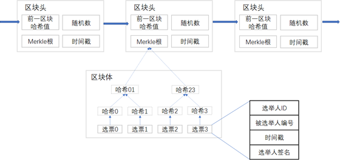
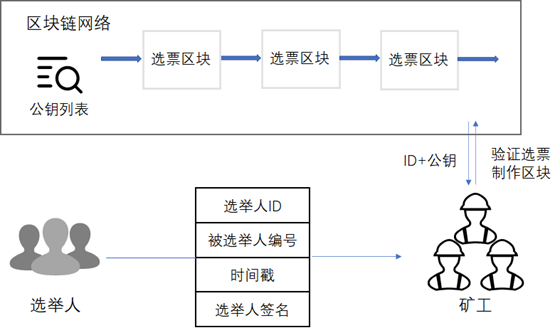
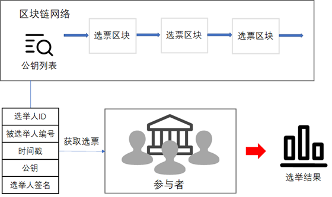

# 区块链选举系统

## 运行方法

- 安装依赖

  `pip install -r requirements.txt`

- 建表

  `python manage.py makemigrations`

  `python3 manage.py migrate`

- 运行

  `python manage.py runserver 0.0.0.0:8000`

- 从浏览器访问 http://localhost:8000 进入测试页面。

## 数据结构

## 系统架构

### 初始化

### 投票

### 计票

